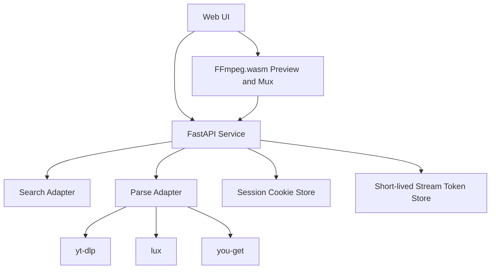

# MediaSeek Web Downloader

Feature Name: mediaseek-web-downloader
Updated: 2026-05-27

## Description

我建议一期项目直接基于 `VnaSeek/beat_analyzer` 演进，并在迁入当前项目时去掉 `beat` 命名痕迹，统一调整为更中性的模块命名。原因很直接：这个基线已经覆盖链接解析、Cookie 临时上传、格式选择、预览播放、前端 FFmpeg.wasm 合并、后端代理流这些关键能力，与你的目标高度重合。

一期增加三块核心能力：

1. 搜索入口：按关键词查询候选视频，再把候选结果送入既有解析链路。
2. Cookie 管理增强：从“一次性上传参与解析”扩展为“当前会话手动加载与替换”。
3. 解析器显式选择：由用户在 `yt-dlp`、`lux` 和 `you-get` 间手动切换，默认 `you-get`。

产品名确定为 `MediaSeek`，中文名确定为 `寻音觅影`。

## Architecture



架构继续保持前后端同仓、FastAPI 提供静态页面和 API。这样迁移成本最低，也能直接复用现有页面结构与交互脚本。

我建议把能力拆成四层：

1. `Search Adapter`：统一关键词搜索结果结构。
2. `Parse Adapter`：封装 `yt-dlp`、`lux` 和 `you-get` 调用，并接收用户选择的解析器参数。
3. `Session Cookie Store`：保存当前浏览器会话关联的 Cookie 临时文件元数据。
4. `Frontend Media Pipeline`：继续负责预览与浏览器端合并。

## Components and Interfaces

### 1. Frontend UI

沿用 `index.html + styles.css + src/main.js` 结构，一期新增这些界面区块：

- 搜索模式和链接模式切换入口
- 解析器选择控件
- 关键词输入框与搜索结果列表
- 当前 Cookie 状态卡片
- 更清晰的格式筛选与标签展示

### 2. Backend API

建议保留现有 API，并新增以下接口：

- `POST /api/search`
  - 输入：`keyword`, `site`, `page`, `engine`
  - 输出：候选视频数组

- `POST /api/cookie/load`
  - 输入：Cookie 文件
  - 输出：当前会话 Cookie 摘要信息

- `POST /api/cookie/clear`
  - 输入：空
  - 输出：清理结果

现有接口继续保留：

- `GET /api/health`
- `POST /api/parse`
- `POST /api/download-url`
- `GET /api/stream/{token}`

在现有接口上补充解析器参数：

- `POST /api/parse`
  - 输入：`url`, `engine`, `cookieFile`
  - 输出：解析结果

### 3. Search Adapter

一期推荐把搜索能力设计成解析器能力矩阵：

1. `you-get` 作为默认解析器，优先承担链接解析。
2. `yt-dlp` 承担主流站点的搜索与解析增强。
3. `lux` 承担国内站点解析扩展。
4. 对当前解析器不支持的搜索场景返回兼容性提示。

这样能保持用户可控，同时避免过早引入独立站点爬虫体系。

### 4. Parse Adapter

解析器策略改为用户显式选择：

1. 默认解析器为 `you-get`
2. 可选解析器为 `yt-dlp`
3. 可选解析器为 `lux`

后端保留统一的适配接口，根据 `engine` 参数路由到对应实现。

## Data Models

### Search Result

```text
{
  id,
  title,
  source,
  duration,
  thumbnail,
  webpageUrl,
  uploader
}
```

### Cookie Session

```text
{
  sessionId,
  filename,
  originalType,
  storedPath,
  loadedAt,
  expiresAt
}
```

### Parse Result Extension

在现有 `parse result` 基础上补充：

```text
{
  engine,
  searchSource,
  previewCapabilities,
  recommendedVideoFormatId,
  recommendedAudioFormatId
}
```

## Correctness Properties

系统需要满足以下正确性约束：

1. 同一时刻只运行一个 FFmpeg 重任务。
2. Cookie 文件只在当前会话内可见，并按生命周期自动清理。
3. 下载链接必须是短期 token，避免直接暴露完整源站请求上下文。
4. 视频下载结果应当与用户所选视频格式和音频格式一致。
5. 搜索结果进入解析流程后，解析结果要与最终目标链接一一对应。
6. 每次解析和搜索请求都要与用户选择的解析器一致。

## Error Handling

重点处理以下错误场景：

1. 搜索无结果：返回空状态和建议改用链接解析。
2. 解析器失败：展示当前解析器错误并提示切换其他解析器。
3. Cookie 无效：提示用户重新导出或更换格式。
4. 预览失败：提示站点限制、链接过期或浏览器资源不足。
5. FFmpeg 合并失败：提示用户改选较低分辨率或较低码率。

错误信息继续使用当前项目的用户可读文案风格，避免泄露临时文件路径与内部命令细节。

## Test Strategy

一期测试策略建议保持轻量但覆盖主路径：

1. 后端语法校验：`python3 -m py_compile backend.py`
2. 前端脚本语法校验：`node --check src/main.js`
3. API 冒烟测试：`/api/health`、`/api/search`、`/api/parse`、`/api/download-url`
4. 手工联调：三种解析器切换、链接解析、关键词搜索、Cookie 加载、视频预览、音频下载、音视频合并下载

## References

[^1]: `VnaSeek` README - `/tmp/opencode/VnaSeek/README.md`
[^2]: `VnaSeek` backend - `/tmp/opencode/VnaSeek/beat_analyzer/backend.py`
[^3]: `VnaSeek` frontend - `/tmp/opencode/VnaSeek/beat_analyzer/src/main.js`
