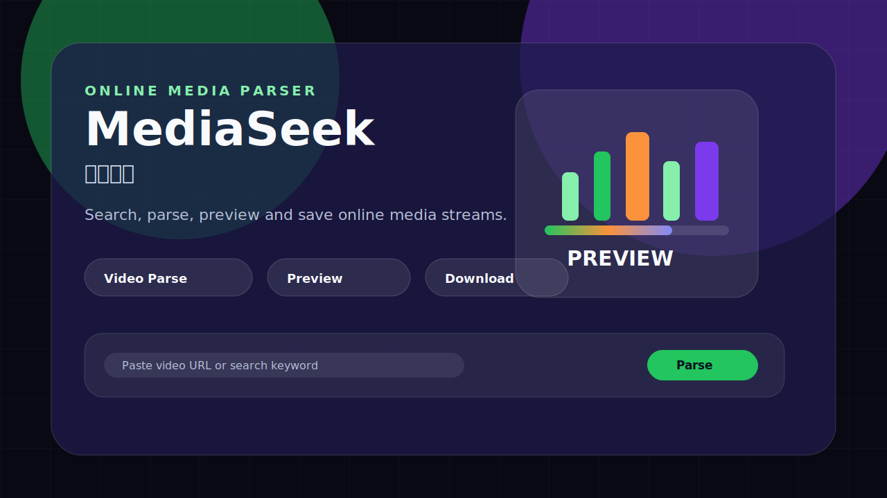

# MediaSeek / 寻音觅影

MediaSeek 是一个 Web 音视频解析、预览与下载工具。它支持通过视频页面链接解析媒体信息，也支持通过关键词搜索视频网站内容后选择目标视频进入解析流程。



当前版本基于 FastAPI 和原生前端实现，解析器支持 `you-get`、`yt-dlp` 和 `lux`，默认使用 `you-get`。分离音视频流合并由浏览器端 `FFmpeg.wasm` 完成，服务端专注于解析、搜索、短期会话和流式转发。

## 功能特性

- 视频链接解析：输入公开视频页面 URL，解析标题、封面、描述、字幕和可下载格式。
- 关键词搜索：从视频网站搜索结果中选择目标视频，再确认解析器进入解析流程。
- 在线预览：解析后自动选择更适合快速缓冲的预览流。
- 格式选择：视频分辨率和音频音质按高到低排序，默认选中最高质量。
- 视频下载：分离音视频流时，通过浏览器端 `FFmpeg.wasm` 合并。
- 音频下载：可独立选择音频流下载。
- Cookie 会话：支持上传 Cookie 文件并在服务端短期复用，便于解析需要登录态的网站。
- 多解析器：支持手动切换 `you-get`、`yt-dlp`、`lux`。
- 流式转发：下载链接通过短期 token 代理源站媒体流，避免服务端落盘保存大文件。

## 项目结构

```text
.
├── docs/
│   └── screenshot.svg      # README 展示图
├── mediaseek_web/
│   ├── backend.py          # FastAPI 后端服务
│   ├── index.html          # Web 页面结构
│   ├── styles.css          # 页面样式
│   ├── src/main.js         # 前端交互、预览、下载和 FFmpeg.wasm 合并逻辑
│   ├── requirements.txt    # Python 依赖
│   └── package.json        # 子项目启动脚本
├── scripts/
│   ├── check.sh            # 语法检查脚本
│   └── start.sh            # 本地启动脚本
├── .env.example            # 可选运行配置示例
├── LICENSE                 # MIT License
└── README.md
```

## 环境要求

- Python 3.11+
- Node.js 18+
- Go 1.20+，用于安装 `lux`
- 可访问目标视频网站和解析器依赖源的网络环境

## 安装依赖

```bash
# 安装 Python 依赖
pip3 install --break-system-packages -r mediaseek_web/requirements.txt

# 安装 lux 解析器
go install github.com/iawia002/lux@latest
```

`yt-dlp` 和 `you-get` 已在 `requirements.txt` 中声明，会随 Python 依赖安装。

## 启动服务

```bash
# 从仓库根目录启动
bash scripts/start.sh
```

也可以进入 Web 子项目启动：

```bash
cd mediaseek_web
python3 backend.py
```

服务默认监听：

```text
http://localhost:5000
```

## 配置项

复制 `.env.example` 后按需设置环境变量。当前后端直接读取运行环境变量。

| 变量 | 默认值 | 说明 |
| --- | --- | --- |
| `PORT` | `5000` | Web 服务监听端口 |
| `COOKIE_SESSION_TTL_SECONDS` | `21600` | Cookie 会话有效期，默认 6 小时 |
| `PARSE_TTL_SECONDS` | `1800` | 解析结果缓存有效期，默认 30 分钟 |
| `TOKEN_TTL_SECONDS` | `21600` | 下载 token 有效期，默认 6 小时 |
| `MAX_COOKIE_FILE_BYTES` | `16777216` | Cookie 文件最大体积，默认 16 MiB |

示例：

```bash
PORT=8080 COOKIE_SESSION_TTL_SECONDS=3600 bash scripts/start.sh
```

## 使用说明

1. 打开页面后，选择解析器。默认解析器为 `you-get`。
2. 可通过关键词搜索视频网站内容，点击搜索结果后确认解析器。
3. 也可直接粘贴视频页面 URL，点击“开始解析”。
4. 需要登录态的网站，先上传 Cookie 文件，再点击“加载 Cookie 会话”。
5. 解析完成后选择视频格式和音频格式。
6. 点击“下载视频”或“下载音频”。

## Cookie 文件支持

不同解析器支持的 Cookie 文件格式如下：

| 解析器 | cookies.txt | Firefox cookies.sqlite |
| --- | --- | --- |
| you-get | 否 | 是 |
| yt-dlp | 是 | 是 |
| lux | 是 | 是 |

Cookie 会话默认保留 6 小时。Cookie 文件用于解析请求和搜索请求，适用于需要登录态或容易触发风控的视频网站。

## 部署建议

本项目可以作为普通 Python Web 服务部署。生产环境建议使用进程管理器运行 `python3 mediaseek_web/backend.py`，并在反向代理层处理 HTTPS、域名和访问日志。

示例流程：

```bash
# 安装依赖
pip3 install --break-system-packages -r mediaseek_web/requirements.txt

# 安装 lux
go install github.com/iawia002/lux@latest

# 指定端口启动
PORT=5000 bash scripts/start.sh
```

部署时请确认 `lux` 可执行文件所在目录已经加入 `PATH`。

## 开发检查

```bash
bash scripts/check.sh
```

该脚本当前执行：

- `python3 -m py_compile mediaseek_web/backend.py`
- `node --check mediaseek_web/src/main.js`

## API 概览

- `GET /api/health`：服务健康检查和解析器可用性。
- `GET /api/cookie/status`：查看当前 Cookie 会话状态。
- `POST /api/cookie/load`：加载 Cookie 文件到服务端会话。
- `POST /api/cookie/clear`：清除服务端 Cookie 会话。
- `POST /api/search`：视频网站关键词搜索。
- `POST /api/parse`：解析视频页面 URL。
- `POST /api/download-url`：生成短期有效下载地址。
- `GET /api/stream/{token}`：后端代理流式转发媒体资源。
- `POST /api/audio/search`：外部音频场景关键词搜索，返回候选视频标题和链接。
- `POST /api/audio/resolve-url`：外部音频场景链接解析，返回音频下载地址。

## 外部音频 API

外部系统可以先用关键词搜索候选视频，再把用户选中的视频链接传给音频解析接口。
音频解析接口返回完整 `downloadUrl`，外部系统可直接发起下载请求。

### 关键词搜索候选视频

```bash
curl -X POST http://localhost:5000/api/audio/search \
  -H "Content-Type: application/json" \
  -d '{"keyword":"搜索关键词","limit":5}'
```

响应示例：

```json
{
  "ok": true,
  "keyword": "搜索关键词",
  "count": 1,
  "results": [
    {
      "title": "视频标题",
      "url": "https://example.com/video/xxx",
      "webpageUrl": "https://example.com/video/xxx",
      "thumbnail": "https://example.com/cover.jpg",
      "duration": 180,
      "durationText": "3:00",
      "uploader": "作者"
    }
  ]
}
```

### 通过视频链接获取音频

```bash
curl -X POST http://localhost:5000/api/audio/resolve-url \
  -H "Content-Type: application/json" \
  -d '{"url":"https://example.com/video/xxx","engine":"you-get","quality":"best"}'
```

`quality` 支持：

- `best`：选择最高音质。
- `smallest`：选择体积最小的音频。
- `first`：选择解析器返回的第一个音频格式。

响应示例：

```json
{
  "ok": true,
  "title": "视频标题",
  "webpageUrl": "https://example.com/video/xxx",
  "extractor": "you-get",
  "duration": 180,
  "durationText": "3:00",
  "uploader": "作者",
  "thumbnail": "https://example.com/cover.jpg",
  "audio": {
    "formatId": "audio-best",
    "label": "audio-best · 128 kbps · M4A",
    "quality": "audio-best · 128 kbps · M4A",
    "ext": "m4a",
    "codec": "mp4a",
    "bitrate": 128,
    "filesize": 3145728,
    "filesizeText": null,
    "downloadUrl": "http://localhost:5000/api/stream/token",
    "proxyUrl": "http://localhost:5000/api/stream/token",
    "directUrl": "https://example.com/audio.m4a",
    "filename": "视频标题-audio-best.m4a"
  }
}
```

## 常见问题

### 提示站点拒绝请求或 HTTP 412

这通常表示目标站点触发了风控或需要有效登录态。请先在浏览器登录目标网站，导出 Cookie 文件并加载 Cookie 会话后重试。

### you-get 上传 cookies.txt 后提示格式不兼容

`you-get` 当前只支持 Firefox 的 `cookies.sqlite`。请使用 Firefox 登录目标网站后，从浏览器配置目录复制 `cookies.sqlite` 上传。

### 下载视频时合并很慢

分离音视频流通过浏览器端 `FFmpeg.wasm` 合并。大文件合并速度取决于浏览器性能、内存和网络速度。

### 解析器不可用

请确认依赖安装完整，并通过 `/api/health` 查看解析器状态。`lux` 需要单独通过 Go 安装并保证命令在 `PATH` 中可用。

### 搜索结果为空

目标站点搜索可能受登录态、网络环境和风控影响。请加载有效 Cookie 会话后重试，或直接粘贴视频页面 URL 解析。

## 安全与使用边界

- Cookie 文件仅用于当前服务的解析、搜索和下载请求，服务会在会话过期或手动清除后移除当前 Cookie 会话。
- 项目不会把 Cookie 内容写入 README、日志或 Git 提交。
- 请勿把个人 Cookie 文件提交到仓库，`.gitignore` 已默认忽略 `cookies.txt` 和 `cookies.sqlite`。
- 本项目用于学习、研究和个人内容备份场景。
- 使用者应遵守目标网站服务条款、版权要求和当地法律法规。

## License

MIT License. See [LICENSE](LICENSE) for details.
